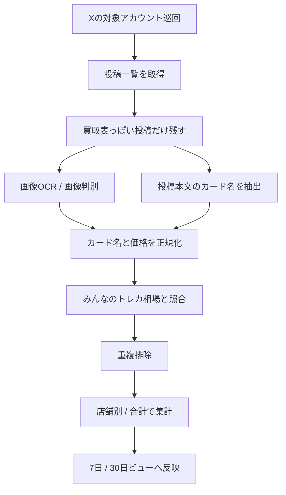

# X 買取表監視の仮設計

対象:
- まずは 1 店舗
- その後に店舗追加
- 画像ベース中心
- 必要に応じて投稿本文のテキストも併用

## 目的

- 指定アカウントの買取表投稿を自動収集する
- 買取表画像からカード名と価格を抽出する
- 7 日 / 30 日の掲載回数を集計する
- 店舗ごとの掲載数と全店舗合計を分けて見る
- 同じカードの再投稿や金額違いの再投稿を重複排除する
- みんなのトレカ相場の PSA10 価格と照合して、安い / 平均 / 高いを判定する
- X の元投稿へ直接飛べるようにする

## 先に決めること

### 収集対象

- まずは `Mist_nagoyaosu`
- 投稿種別は「買取表」だけを対象
- ポケモンカードのみ対象

### 収集方法

- 第一候補: ログイン済みブラウザでの定期巡回
- 第二候補: 公開ページの解析
- 第三候補: X API または外部取得手段

### 保存方針

- 元画像は長期保存しない
- 残すのはメタデータ中心
- 必要ならサムネイルのみ保存

## データ構造案

### shops

- `shopId`
- `accountHandle`
- `displayName`
- `xProfileUrl`
- `status`

### posts

- `postId`
- `shopId`
- `postedAt`
- `text`
- `postUrl`
- `imageUrls`
- `imageHashes`
- `sourceType`

### listings

1 投稿の中に複数カードがある前提。

- `listingId`
- `postId`
- `shopId`
- `cardNameRaw`
- `cardNameNormalized`
- `setCode`
- `cardNumber`
- `gradeLabel`
- `price`
- `currency`
- `matchConfidence`
- `detectedFrom`
- `imageIndex`

### card_stats_daily

- `shopId`
- `cardKey`
- `date`
- `count`
- `priceMin`
- `priceMax`
- `priceAvg`

### card_stats_window

- `shopId`
- `cardKey`
- `windowDays`
- `count`
- `lastSeenAt`
- `medianPrice`

### dedupe_keys

- `postId`
- `imageHash`
- `normalizedTextHash`
- `shopId + cardKey + price + date`

## 重複排除ルール

### 同一投稿

- `postId` が同じなら 1 回だけ保存

### 同一画像

- `imageHash` が同じなら再収集でも重複扱い

### 同日再投稿

- 同じ `shopId + cardKey + price` が同日なら 1 件にまとめる

### 金額違い再投稿

- 価格が変わったら別履歴として残す
- ただし集計時は「同一日内の連続差分」を除外できるようにする

## 判別フロー

## 集計ロジック案

### 掲載回数

- `7日掲載回数`
- `30日掲載回数`
- `全期間掲載回数`

### 価格比較

- `店舗平均価格`
- `全店舗平均との差`
- `平均との差率`
- `最安 / 最高 / 中央値`

### 判断ラベル

- `掲載回数が多い`
- `掲載回数が少ない`
- `価格が安い`
- `価格が平均`
- `価格が高い`

## 画面案

### 一覧

- カード画像
- カード名
- 店舗名
- 7 日掲載回数
- 30 日掲載回数
- 店舗別平均価格
- 全体平均価格
- X へのリンク

### 絞り込み

- 店舗
- 7 日掲載回数下限
- 30 日掲載回数下限
- 価格帯
- 安い / 平均 / 高い
- 画像判別の信頼度

### 詳細

- 元投稿
- 画像
- 抽出結果
- 同一カードの過去履歴
- 店舗別推移

## 容量対策

- 画像を全部ためない
- テキストと数値を主データにする
- 元画像は短期キャッシュ
- サムネイルだけ残す
- 店舗が増えたらサイトを分ける

## 運用案

### 毎日

- 指定時刻に新規投稿を確認
- 新着分だけ追加
- 7 日 / 30 日集計を更新

### 過去分

- 必要な範囲だけ遡って補完
- すべてを毎回再取得しない

## MVP 順

1. 1 店舗の投稿一覧取得
2. 画像からカード名と価格を 1 枚ずつ抽出
3. 重複排除
4. 7 日 / 30 日の件数集計
5. みんなのトレカ相場と価格比較
6. X リンク表示
7. 店舗追加

## 今回の結論

- 容量的には、メタデータ中心なら十分いける
- 画像を全部永続保存すると重くなる
- なので最初は 1 店舗で精度検証するのが正解
- その後に店舗ごと集計と合計集計を分けて拡張する
